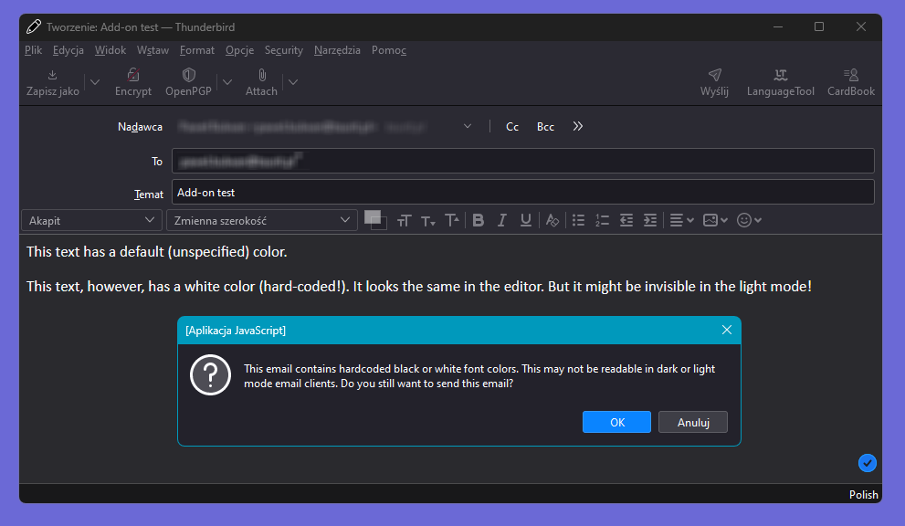
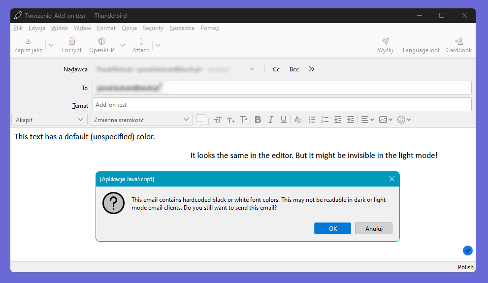

# Thunderbird.FontColorValidator

## About this repository

This is a **proof-of-concept** for a Thunderbird add-on that warns if an email you composed contains problematic font colors. "Problematic" is defined as colors that might be invisible or barely visible if email's recipient's uses different color mode than you (dark or light).

## The problem

When you compose the email, you might paste some content that is inconsistent with the formatting of the rest of email.

It's natural then for a human to change the color to match the rest of the text, for consistency. However, we typically forget that recipient might read emails either on the dark or the white background. If we hardcode font color (instead of just resetting the style to default), some text might be invisible and cause confusion! And we might never know.

Compare the same email displayed in two color modes:

## Is it useful?

This is just a quick proof of concept created with some help from ChatGPT 4 ;) If you find it useful and want me to put some more attention into developing this addon, consider one of the following:

- Star the repository to let me know someone else uses it, too :)
- Create a GitHub issue in this project if you encountered any bug or want to suggest an issue.